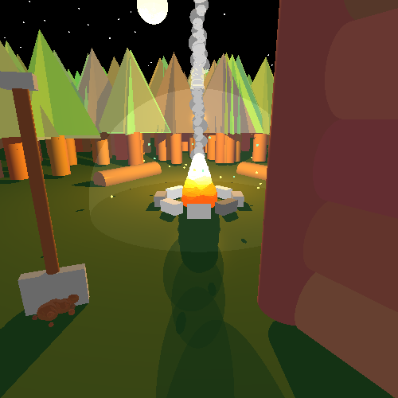
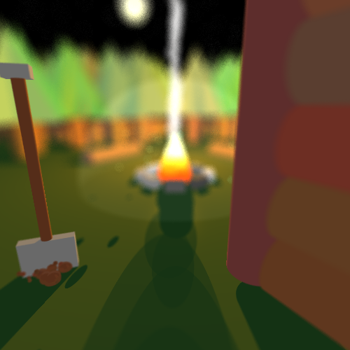
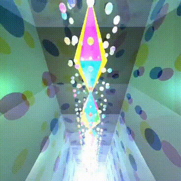
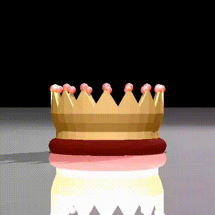
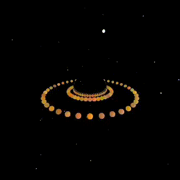

# 🌌 ISE5785 Ray Tracing Engine – Realistic Rendering in Java

Welcome to one of the most complete and flexible ray tracing engines built in Java as part of the ISE course project at the Technion. This renderer is designed from the ground up to support **photorealistic image generation**, leveraging both physical lighting principles and smart acceleration techniques.

Whether you're here to explore rendering algorithms, see how Java handles complex geometric math, or dive into adaptive supersampling, you're in the right place.

---

## 🔭 Motivation

Ray tracing is the foundation of many modern rendering pipelines in CGI and real-time graphics. While often explored in C++, we chose Java to demonstrate how even a managed language can handle the mathematical rigor and architectural demands of a physically-based renderer.

This project was created to explore:

- The tradeoffs of ray-based rendering vs rasterization
- The impact of adaptive sampling techniques on realism and performance
- The elegance and challenges of creating your own camera, light, and material systems from scratch

> What started as a class assignment quickly evolved into a modular, extensible rendering engine with real-world inspiration from Pixar, Blender, and modern game engines.

---

## ✨ Features at a Glance

✔️ **Physically-Based Materials**  
✔️ **Phong Illumination Model** with interpolated normals and smooth highlights  
✔️ **Adaptive Supersampling** (unified for all effects)  
✔️ **Depth of Field**, **Soft Shadows**, and **Glossy Reflections**  
✔️ **Voxel Grid Acceleration** with 3D DDA traversal  
✔️ **Scene Management & Modular Object Hierarchy**  
✔️ **Support for Animations and Video Rendering**  
✔️ **Clean, layered architecture ready for extension**

---

## 📸 Visual Preview

<p align="center">
  
  
</p>

<p align="center">
  <i>Lighting, reflections, depth of field, and more – all rendered with physical logic.</i>
</p>

---

## 🧱 Architecture Overview

This project is structured using **clean separation of responsibilities**. Each component handles only what it's meant to:

- `geometries/` – Abstract and concrete shapes (Sphere, Plane, Cube, Polygon, etc.)
- `lighting/` – PointLight, SpotLight, DirectionalLight, AreaLight, CylinderLight
- `primitives/` – Core math: Vectors, Points, Colors, Rays, Bounding Boxes
- `renderer/` – Rendering engine, camera logic, blackboard (ray construction), pixel management
- `scene/` – Scene configuration, light/geometry/material setup
- `tests/` – Dozens of structured tests to validate rendering features and output scenes

---

## 🔍 Adaptive Sampling Explained

Instead of relying on brute force supersampling, we built an **intelligent sampling controller** called `Blackboard`, which:

- Dynamically distributes rays per pixel based on context
- Supports all 4 enhancements via one unified system:
  - 🎯 Anti-aliasing
  - 🔆 Soft shadows (by sampling light shapes)
  - 🔭 Depth of field (by sampling aperture)
  - ✨ Glossy surfaces (by jittering reflection directions)

This system dramatically reduces the number of rays needed while **retaining high-quality output**, especially around edges and light transitions.

---

## 📽️ Animation & Video Rendering

We go beyond static images. Our renderer is capable of generating **frame-by-frame sequences**, suitable for animation and cinematic effects.
✨ **Examples:

<div align="center">
  
  
  
</div>

<p align="center">
  <i>All visuals rendered by this engine. No textures, no models – just math and rays.</i>
</p>
---

## 🛠️ How to Run

### 1. Clone the repository:
```bash
git clone https://github.com/LidanR/ISE5785_5900_6319.git
cd ISE5785_5900_6319
